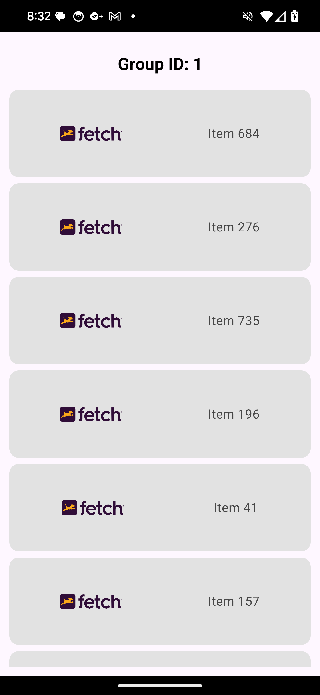
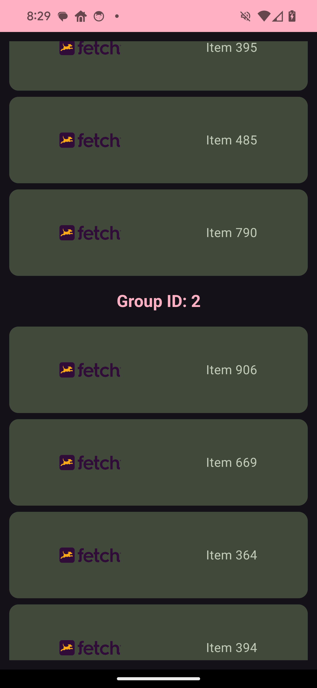

# Fetch Rewards Coding Exercise - Software Engineering - Mobile
## Author: Jose Davila - mannydroiddev@gmail.com

# The application package structure
```
├── com.josedavila.fetchrewards
│   ├── adapters - contains Moshi BigDecimal custom adapter
│   ├── converters - contains Room BigDecimal custom type adapter
│   ├── data
│   ├── datasources
│   │   ├── db - contains Room DB interfaces and database implementation
│   │   ├── remote - contains service API interfaces
│   ├── di - contains all dependency injection modules and application
│   ├── mappers - contains mappers to map response models to UI models
│   ├── models - contains all models
│   ├── navigation - contains navigation host and routes
│   ├── repositories - contains all repository interfaces and implementations
│   ├── ui - contains main UI composables and main activity
│   │   ├── components - contains Compose component composables
│   │   ├── screens
│   │   │   ├── rewards - contains rewards list screen and view model
│   │   ├── theme - contains all theme related files
│   ├── usecases - contains all use cases
└── ├── utilities - constains utilities such as Constants
```
# Screenshots
#### Dynamic Light Theme




#### Dynamic Dark Theme





#### Landscape Mode


#### No Rewards Found


#### Technical Difficulties


#### Another Dynamic Theme


